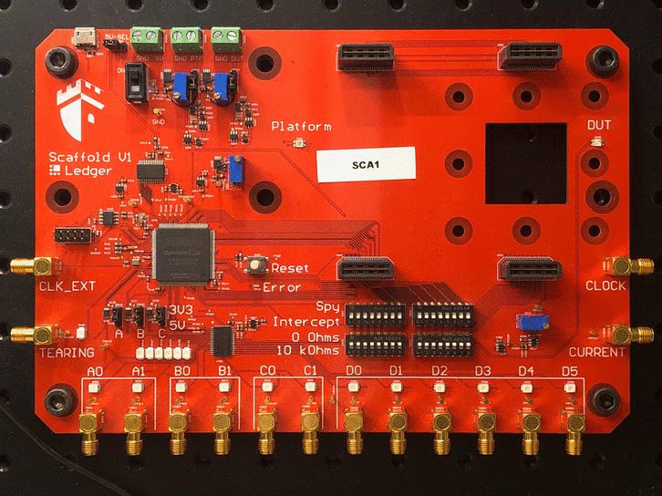

# Scaffold

When performing hardware security evaluation of integrated circuits and embedded
platforms, the first step is to setup the device to be able to automate tests,
retrieve results and trigger instruments to perform measurements or inject
faults. Scaffold is an electronic motherboard designed to quickly setup,
instrument and test cirtcuits. The board can be controlled through USB using a
Python3 API, enabling easy development of tests. All the project is
Open-Hardware and Open-Source.

The FPGA architecture runs at 100 MHz and embeds many peripherals:

- 2 x UART,
- I2C (master),
- ISO7816 (master),
- SPI (master),
- Power supply controllers for each evaluation socket,
- 4 x Delay and pulse generators with 10 ns resolution
- 2 x chaining modules for advanced triggering
- Clock generator with glitching feature
- And more to come in the future!

The board also integrates an 11X analog amplifier with 200 MHz bandwidth for
power measurement. The on-board shunt resistor can be tuned from 0 to
100 Ohms.

Scaffold is able to operate from 1.5V to 3.3V devices: power supplies and I/O
bank voltage can be tuned thanks to adjustable voltage regulators. Scaffold can
be powered from USB or external power supplies.

Four special I/Os can generate 5V pulses, which are compatible with
*ALPhANOV PDM* laser sources (50 Ohm TTL).

## Getting the board

All the files required to fabricate the board are included in the repository.
If you do not wish to build it yourself, you can request for quotation by
sending a mail to scaffold@ledger.fr (only for Europe or USA shipping).

## Installation

Python3 library can be installed using pip:

    pip3 install donjon-scaffold

## Documentation

API documentation is available on [Read the Docs](https://donjonscaffold.readthedocs.io).

## Licensing

Scaffold is released under GNU Lesser General Public Licence version 3 (LGPLv3).
See COPYING and COPYING.LESSER for license details.

