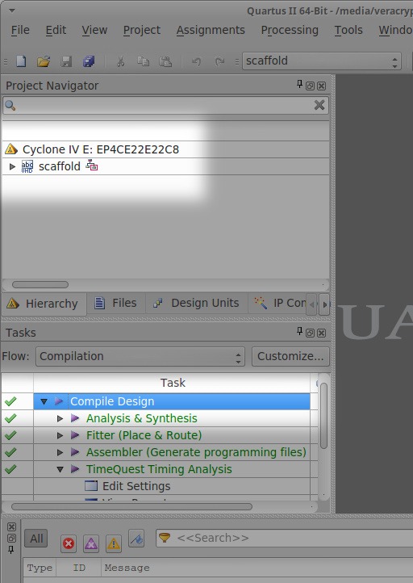
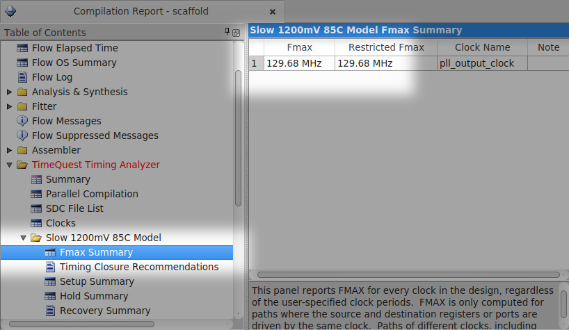
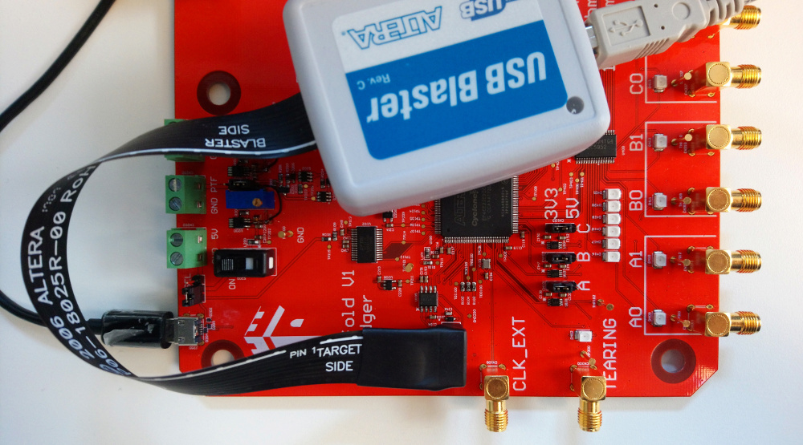
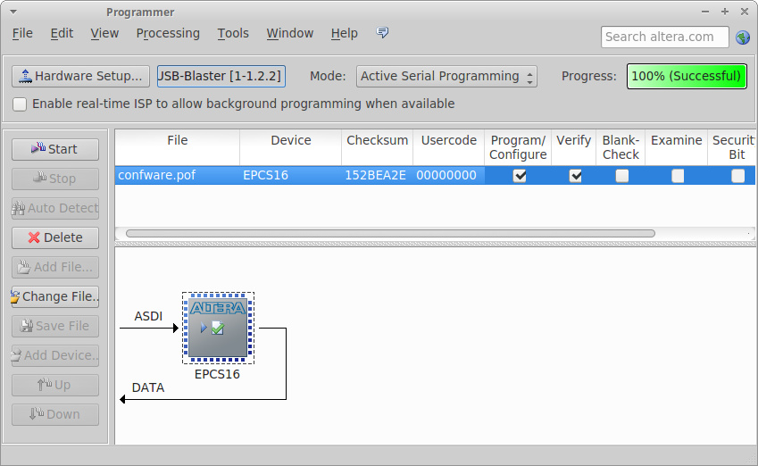

Building and flashing the FPGA bitstream
========================================

Advanced users may want to modify the architecture of the FPGA of Scaffold to
support more peripherals, implement new features or even fix bugs. This section
briefly describe how to build the FPGA bitstream with Intel (Altera) tools, and
flash the board.

Prerequisites
-------------

*Quartus II* software from Intel (Altera) must be used to build the FPGA
bitstream. The version of Quartus must have support for Cyclone IV devices;
version 14.1 can be used. Although *Quartus* is a proprietary tool, the free
*Quartus Web Edition* can be used and shall not require any license. Quartus
can run on linux and Windows (but we did not give a try on Windows).

For flashing the FPGA, a programmer supporting *Active Serial* mode must be
used. *Altera USB Blaster* is a good one.

Building the bitstream
----------------------

Under *Quartus* software, load the ``fpga-arch/scaffold.qpf`` project file with
the *File > Open Project* menu. Build the design with *Start* context-menu of
*Compile Design* task as highlighted below.

Hopefully the compilation should succeed. If you modified the original design,
we recommand you to check in the compilation report that the max frequency of
the system clock of the compiled design is at least 110 MHz (100 MHz plus some
security margin). If this constraint is not respected, then your design may not
work properly and need to be optimized.

Flashing the FPGA
-----------------

Power-on the board and connect the programmer as shown below:

In *Quartus*, open the programmer window with the *Tools > Programmer* menu.

- Setup your programmer with the *Hardware Setup* button.
- Switch to *Active Serial Programming* mode.

- Click on *Add File...* and select the file ``confware.pof``. The setup shall
  represent an EPCS16 device, which is the on-board Flash memory storing the
  bitstream and read by the FPGA when powering-up Scaffold.

- Check the *Program/Configure* and *Verify* boxes.
- Click on the *Start* button.

Remove the programmer cable to test your new design!

