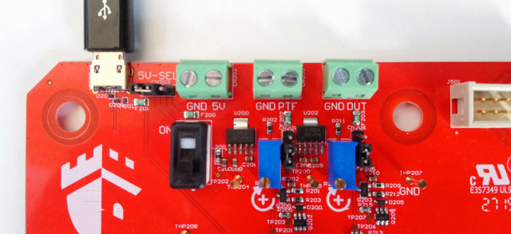

.. _external_power_supplies:

Using external power supplies
=============================

Three connectors allow using external power supplies instead of the 5 V USB
source.

- First green connector "GND 5V" allows connecting a 5 V - 1 A power source
  for powering all the board. The jumper "5V-SEL" on the left must be set to the
  right to disconnect the USB power source and connect the external power supply
  instead.

- Second green connector "GND PTF" allows connecting a 5 V - 1 A power source
  for powering the platform socket. The jumper below must be set to the top to
  disconnect the board power source and connect the external power supply
  instead.

- Third green connector "GND DUT" allows connecting a 5 V - 1 A power source
  for powering the Device Under Test platform socket. The jumper below must be
  set to the top to disconnect the board power source and connect the external
  power supply instead.

External power supplies current must be limited to a current less than 5 A.
When using multiple power supplies, connect their ground signals together.
