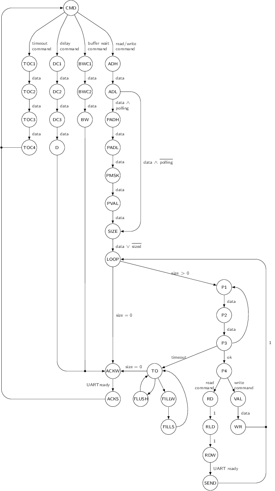

FPGA bus bridge
===============

The bus bridge allows reading and writing bytes on the internal FPGA bus using
commands sent in serial. This bridge is implemented in VHDL using a Finite State
Machine. The state machine manages the commands parsing and execution.

The state machine has a lot of states and is a bit complex. However, the parsing
and execution of a command is faster than the time required to receive an
incoming new command - making it hard to saturate the commands queue. The only
cases a command queue can be overflowed is when using polling commands - in such
cases the application may wait for the response before sending further commands.

Overflowing the commands queue will usually lead to entering the
error state as bytes will be discarded, resulting in data bytes being
interpreted as invalid command codes. When in error state, the error LED on the
board is lit. The only way to recover from the error state is pressing the reset
button.

State machine
*************

The following graph is the bus bridge finite state machine implemented in the
FPGA. This document is an help for understanding FPGA internals.

Details on states:

- ``CMD``: Idle state, awaiting for command byte.
- ``ADH``: Awaiting for read/write address high nibble.
- ``ADL``: Awaiting for read/write address low nibble.
- ``PADH``: Awaiting for polling address high nibble.
- ``PADL``: Awaiting for polling address low nibble.
- ``PMSK``: Awaiting for polling mask.
- ``PVAL``: Awaiting for polling value.
- ``SIZE``: Read/write size fetch. If the command does not require size
  parameter, use value 1 by default. Otherwise, wait and store next byte
  received on UART.
- ``LOOP``: Preload polling address on the bus for P1 and P2 states. Return to
  initial state if all bytes have been read or written.
- ``ACKW``: Wait for UART to be ready to transmit an acknoledge byte. This also
  acts as a delay cycle required for data bus to be available (due to
  pipelining).
- ``ACKS``: Send result byte on UART (command acknowledge or register value).
- ``P1``: First polling state. Assert bus read signal. Due to pipelining, the
  data read from the bus is available to the rest of the logic at ``P2``.
- ``P2``: Second polling state. Used for pipelining (registers the data read
  from the bus).
- ``P3``: Polling test. If polling value matches, leave polling by going to
  ``P4``. Otherwise, return to ``P1`` for a new polling read cycle.
- ``P4``: End of polling. Load register address on the bus.
- ``VAL``: Read from UART the byte to be written in register.
- ``WR``: Register write cycle.
- ``RD``: Register read cycle.
- ``RLD``: Register load cycle, waits for the read data to be available on the
  bus.
- ``RDW``: Wait for UART to be ready to transmit the read byte.
- ``RDS``: Send the read byte via UART.
- ``TO``: Timeout state. Loops until all unprocessed bytes have been discarded
  (write operation) or returned as zeros (read operation).
- ``FLUSH``: Cycle used to discard a byte from the input FIFO during a write
  operation which has timed out.
- ``FILLW``: Wait for UART to be ready.
- ``FILLS``: Transmit a filling byte to replace unread bytes.
- ``TOC1``: Awaiting for timeout configuration first byte.
- ``TOC2``: Awaiting for timeout configuration second byte.
- ``TOC3``: Awaiting for timeout configuration third byte.
- ``TOC4``: Awaiting for timeout configuration fourth byte.
- ``BWC1``: Awaiting for buffer wait configuration first byte.
- ``BWC2``: Awaiting for buffer wait configuration second byte.
- ``BW``: Awaiting for command buffer to be complete.
- ``DC1``: Awaiting for delay first byte.
- ``DC2``: Awaiting for delay second byte.
- ``DC3``: Awaiting for delay third byte.
- ``D``: Delay operation. Exits when the delay counter reaches 0.

Details on transition conditions:

- ``1``: Unconditionally pass to the next state at the next clock cycle.
- ``data``: True when the UART FIFO has a byte available.
- ``size``: Number of remaining bytes to be read or written.
- ``ready``: True when the UART of the bus bridge is ready to transmit a byte.
- ``read_command``: True when the fetched command byte corresponds to a bus read
  cycle command.
- ``write_command``: True when the fetched command byte corresponds to a bus
  write cycle command.
- ``buf_wait_command``: True when the fetched command byte corresponds to a bus
  buffer wait command.
- ``delay_command``: True when the fetched command byte corresponds to a bus
  delay command.

Polling timeout configuration
*****************************

A special command bit allows reconfiguring the polling timeout delay. The delay
parameter is stored in an internal 32 bits register and encodes a number of
clock cycles to wait during polling state (1 unit equals to 3 clock cycles).
When this register is set to 0, the timeout is disabled. Note that disabling
the timeout is not recommended since the FSM may stuck in a polling operation
forever or until general reset.

The maximum possible timeout duration is approximately 128 seconds.
