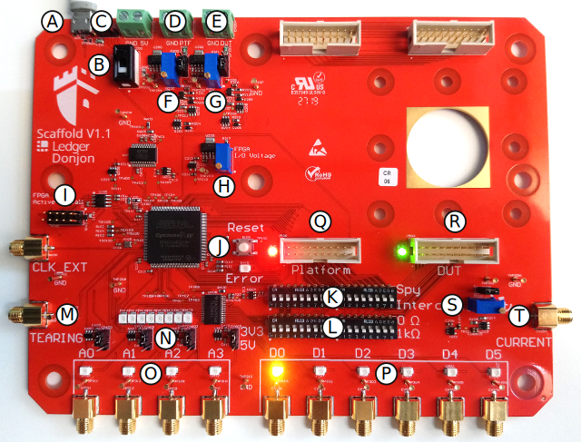

Getting started
===============

Scaffold is a FPGA board made for security research on hardware embedded
devices. It is capable of communicating with many circuits using standard
protocols. It can be easily extended with new protocols by writing new
transceivers in VHDL or Verilog language, and integrating it in the proposed
scaffold global architecture. When exchanging messages with the devices under
tests, Scaffold can generate triggers for chosen commands, spy data on a bus or
intercept and traffic.

Scaffold board also embeds special electronics tailored for hardware attacks:

- Sense resistor and analog amplifier for real-time current measurement
- FPGA safety protections against voltage glitch attacks
- Controllable power switches
- Fast power tearing capability, for emergency shutdown of the device under test
- Delay and pulse generators, allowing firing glitches or laser pulses.

An easy-to-use python API is provided to control the board. https://github.com/Ledger-Donjon/scaffold

Board tour
----------

- **A**: USB2 link with host computer. Also used to power the board.
- **B**: Main board power switch.
- **C**: Switch the jumper to the right to power the board from an external 5 V
  power supply and not from the USB.
- **D**: External power supply for the platform socket.
- **E**: External power supply for the DUT socket.
- **F**: Adjustable voltage regulator for the platform socket. When the jumper
  is set on top position, this power source is not used and the platform socket
  is powered from the external power supply.
- **G**: Adjustable voltage regulator for the DUT socket. When the jumper is set
  on top position, this power source is not used and the DUT socket is powered
  from the external power supply.
- **H**: Adjustable voltage regulator for the I/O bank of the FPGA connected to
  the platform and DUT sockets. This allows setting the correct voltage
  depending on the connected device. Supported voltage range goes from 1.5 V up
  to 3.3 V.
- **I**: FPGA active serial connector for bitstream programmation. An USB
  blaster can be used to update the bitstream.
- **J**: FPGA reset button. Push if the board enters error state.
- **K**: Switches to select Spy or Intercept mode for each I/O of the FPGA. In
  intercept mode, the signals of the platform and DUT sockets are not connected
  anymore and the FPGA can act as a man in the middle circuit.
- **L**: Switches to enable 1 KOhm series protection resistors on the I/Os (at
  the cost of slew-rate). Shall be enabled when there is a risk to damage the
  FPGA, with high-voltage glitches for instance.
- **M**: Tearing input. Any positive edge will power-off the DUT immediately and
  shunt all I/Os to ground.
- **N**: A0, A1, A2, A3 voltage standard selection between 3.3 V or 5 V. Move
  the jumper to change the voltage of the corresponding I/O.
- **O**: I/Os with voltage translators. 5 V is suited to drive Alphanov TTL
  50 Ohm laser sources (other 3.3 V I/Os can't).
- **P**: FPGA I/Os. Maximum voltage is 3.3 V. Those I/Os are connected to the
  platform and DUT sockets and are usually used to communicate with the target
  device and generate triggers. SMA connectors are provided for D0 to D6.
- **Q**: Platform socket and power state LED.
- **R**: DUT socket and power state LED.
- **S**: Adjustable shunt resistor for power trace measurement.
- **T**: Output of the analog 11 X amplifier for power trace measurement.

Connecting the board
--------------------

Connect the board with a micro-USB cable to your computer. Power-on the board
using the power switch. The operating system shall detect the board as a
USB-To-Serial device (COMx on Windows, /dev/ttyUSBx on linux). It may be
necessary to install FTDI driver for some Windows versions.

Using the Python API
--------------------

The file ``scaffold.py`` is the library which can be used to interact with
Scaffold board.

.. code-block:: python
    
    from scaffold import Scaffold

    # Connect to the board.
    # This will open the serial device and check for hardware version
    scaffold = Scaffold('/dev/ttyUSB0')

    # Configure UART0 for operation
    uart = scaff.uart0
    uart.baudrate = 115200

    # Connect UART0 signals to board pins
    # << operator connects signals. Left operand is the destination, right operand
    # is the source (the order is important)
    # In this example, D0 and D1 are configured as outputs, D2 is configured as an
    # input.
    scaffold.d0 << uart.tx
    scaffold.d1 << uart.trigger
    uart.rx << scaffold.d2

    # UART is now ready to use
    uart.send('Hello world !')

