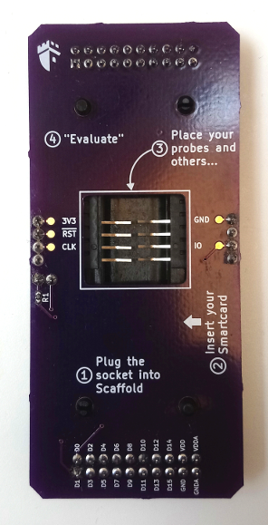

Smartcard kit
=============

This kit allows communicating with the embedded ST bootloader of STM32F2
devices. It is possible to write the Flash memory to load code, and then
execute it after reset.

The class :class:`scaffold.iso7816.Smartcard` of the Python API provides
methods to communicate with an ISO7816 Smartcard and setup tests very quickly.
Currently, only T=0 protocol is supported by the API and it has not been tested
extensively yet.

Pinout
------

+----+---------------------------------------------------------------------+
| D0 | I/O. This signal is pulled up with a resistor on the daughter board |
+----+---------------------------------------------------------------------+
| D1 | nRST                                                                |
+----+---------------------------------------------------------------------+
| D2 | CLK                                                                 |
+----+---------------------------------------------------------------------+
| D3 | Socket card presence contactor                                      |
+----+---------------------------------------------------------------------+
