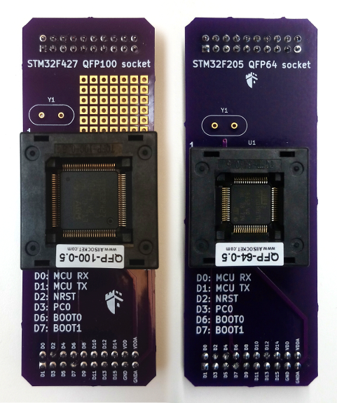

STM32F2 QFP64 kit
=================

STM32 kits allows communicating with the embedded ST bootloader of STM32F205 and
STM32F427 devices. It is possible to write the Flash memory to load code, and
then execute it after reset.

Those QFP64 and QFP100 may suit other STM32 devices. Some breadboard space
allows customizing the daughterboard for special needs, such as clock or voltage
glitch electronics.

Python API example
------------------

The class :class:`scaffold.stm32.STM32` of the Python API provides methods to
communicate with the circuit and setup tests very quickly.

.. code-block:: python

    from scaffold import Scaffold
    from scaffold.stm32 import STM32

    stm = STM32(Scaffold('/dev/ttyUSB0'))
    # Load some code into Flash memory
    stm.startup_bootloader()
    stm.extended_erase()
    stm.write_memory(0x08000000, open('program.bin', 'rb').read())
    # Run the program
    stm.startup_flash()

Example script
--------------

An example file in `examples/stm32.py` can be used to load and execute code
onto a STM32F2 device.

.. code-block:: console

    $ python3 stm32.py -d /dev/ttyUSB0 --load program.bin --run
    Communication initiated
    Product ID: 0x0411
    Possible device match: stm32f2xxxx
    Get: 310001021121314463738292
    Bootloader version: 3.1
    Option bytes: ffaa0055ffaa0055ffff0000ffff0000
    RDP: no protection
    Erasing Flash memory...
    Programming...
    Verifying...
    Flash memory written successfully!
    Rebooting from Flash memory...
